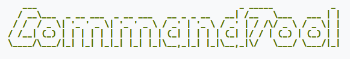
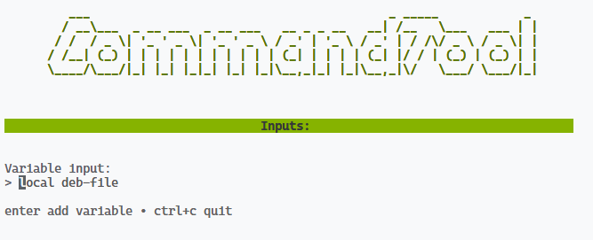

TUI Tool that can execute system commands and commands on a remote host

Commands must be defined in a .YAML-File and can be reused. CMD-Tool also has the option recieve user input when executed

## YAML-File

```yaml
remoteUser: "remUser"
remoteHost: "IP to host"
idRsaPath: "path\\to\\private\\key"
# Custom variables that can be defined
# They can be called with 
variables:
    home: "\home"
    # User input when cmd-tool runs
    debfile: "{{input:local deb-file}}"
# Define global commands that can be run
cmd:
    # Command name
    scp:
        # system command
        cmd: scp
        # 'exec' to execute the command local
        # 'ssh' to execute the command on the remote host
        type: exec 
        # amount of parameter needed to run this command
        params: 2
    install:
        cmd: apt
        type: ssh
        # Arguments are always send
        args:
            - "install"
        params: 1
runCmds:
    - cmd: scp
      description: "Copy deb-file to vm"
      # Stop everything if this commands fails
      stopAfterFail: true
      # In case not everything should be executed, define the run index
      runIndex: 1
      # As defined with the cmds it needs 2 parameters
      params:
        - "{{downloadfolder}}{{debfile}}"
        - "{{remoteUser}}@{{remoteHost}}:{{home}}"
  - cmd: install
    description: "Installing new PromosNG version"
    stopAfterFail: true
    runIndex: 1
    params:
      - "{{home}}/{{debfile}}"
```

